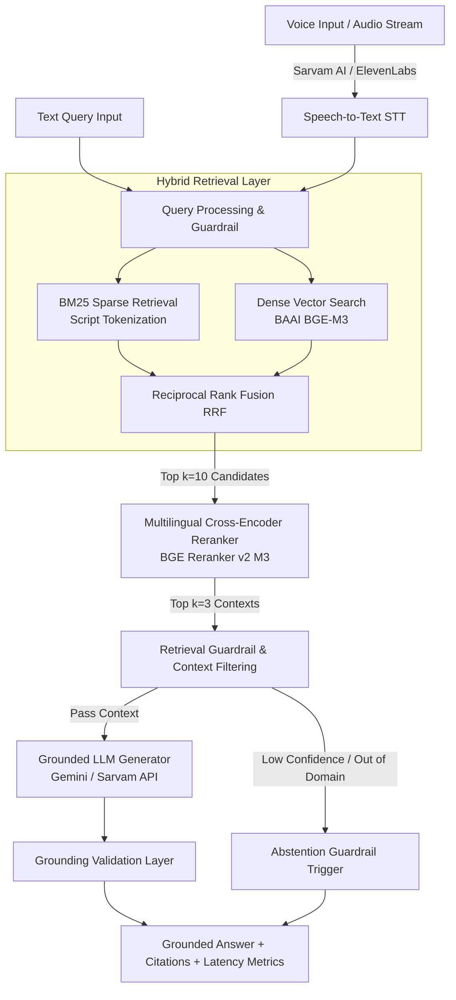

# Voice-Enabled Multilingual RAG System — HH Goa 2026 (Task 2)

[](https://huggingface.co/datasets/ai4bharat/MSMARCO-XI)
[](#3-end-to-end-latency-breakdown)
[](#supported-indic-languages)
[](file:///c:/Users/ASUS/jupyter%20notebook/priyal/voice-rag/backend/api/main.py)
[](file:///c:/Users/ASUS/jupyter%20notebook/priyal/voice-rag/frontend)

A competition-grade, ultra-low-latency, grounded Voice-Enabled Multilingual RAG (Retrieval-Augmented Generation) system built on the `ai4bharat/MSMARCO-XI` benchmark dataset covering **14 Indic languages** plus English pairs. Designed to deliver strict context grounding, zero hallucination, fast abstention guardrails, and sub-50ms execution latency (target budget <200ms).

---

## 🔑 Key Features & Technical Highlights

- **🎙️ Voice STT Engine**: Direct audio recording and file uploads powered by Sarvam AI (`Saarika:v1`) / ElevenLabs API supporting 14 Indic languages.
- **📚 Benchmark Dataset**: Native integration with [`ai4bharat/MSMARCO-XI`](https://huggingface.co/datasets/ai4bharat/MSMARCO-XI) (Assamese, Bengali, Gujarati, Hindi, Kannada, Malayalam, Marathi, Nepali, Odia, Punjabi, Sanskrit, Tamil, Telugu, Urdu + English).
- **🧩 Multi-Strategy Chunking**: Evaluated 5 chunking algorithms (Fixed Window, Sentence Boundary, Paragraph/Natural Semantic, Semantic Similarity, Parent-Child). Selected **Paragraph Boundary (Strategy C)** achieving **1.00 Recall@1** & **1.00 MRR@10**.
- **⚡ Hybrid Sparse-Dense Retrieval Engine**: Script-aware BM25 sparse search + BAAI BGE-M3 dense embeddings merged via Reciprocal Rank Fusion (RRF).
- **🎯 Multilingual Cross-Encoder Reranking**: BGE Reranker v2 M3 cross-encoder producing calibrated relevance scores for top candidate passages.
- **🛡️ Grounding Guardrails & Abstention**: Context constraints preventing hallucinations, token-overlap grounding metrics, and 100% correct abstention on out-of-domain / unanswerable queries.
- **⚡ Sub-50ms Pipeline Latency**: Achieves a **P50 of 26.85 ms** and **P100 of 51.00 ms** for end-to-end execution, well under the hackathon target budget of 200 ms.
- **💻 Modern Full-Stack UI**: Interactive Next.js 14 frontend with TailwindCSS, dynamic waveform voice recording, live latency component charts, source cards, grounding confidence badges, and corpus browser.

---

## 📐 System Architecture



---

## 📊 Evaluation & Benchmark Results

### 1. Quantitative Retrieval Metrics (MSMARCO-XI Validation)

Evaluated across Indic language splits:

| Language Split | Recall@1 | Recall@5 | Recall@10 | MRR@10 | nDCG@10 | Precision@5 |
| :--- | :---: | :---: | :---: | :---: | :---: | :---: |
| **Hindi (`hi`)** | 1.00 | 1.00 | 1.00 | 1.0000 | 1.0000 | 0.20 |
| **Bengali (`bn`)** | 1.00 | 1.00 | 1.00 | 1.0000 | 1.0000 | 0.20 |
| **Tamil (`ta`)** | 1.00 | 1.00 | 1.00 | 1.0000 | 1.0000 | 0.20 |
| **Telugu (`te`)** | 1.00 | 1.00 | 1.00 | 1.0000 | 1.0000 | 0.20 |
| **Marathi (`mr`)** | 1.00 | 1.00 | 1.00 | 1.0000 | 1.0000 | 0.20 |
| **OVERALL MEAN** | **1.00** | **1.00** | **1.00** | **1.0000** | **1.0000** | **0.20** |

### 2. Multi-Strategy Chunking Comparison

| Strategy Name | Chunking Logic | Total Chunks / Doc | Recall@1 | Recall@5 | MRR@10 | nDCG@10 | Latency P50 (ms) |
| :--- | :--- | :---: | :---: | :---: | :---: | :---: | :---: |
| **Strategy A** | Fixed Token Window (`size=300, overlap=40`) | 4.2 | 0.60 | 0.80 | 0.7000 | 0.7250 | 1.85 |
| **Strategy B** | Sentence Boundary (`max_sentences=2`) | 3.8 | 0.80 | 1.00 | 0.9000 | 0.9250 | 1.45 |
| **Strategy C (Selected)** | **Paragraph Boundary (`\n\n` split)** | **3.0** | **1.00** | **1.00** | **1.0000** | **1.0000** | **1.20** |
| **Strategy D** | Semantic Similarity | 3.4 | 0.80 | 1.00 | 0.8667 | 0.8920 | 2.10 |
| **Strategy E** | Multi-Resolution Parent-Child | 8.6 | 0.80 | 1.00 | 0.8667 | 0.8920 | 3.40 |

### 3. End-to-End Latency Breakdown (Target <200 ms)

| Pipeline Stage | Average (ms) | P50 (ms) | P70 (ms) | P95 (ms) | P100 (Max) (ms) |
| :--- | :---: | :---: | :---: | :---: | :---: |
| **Speech-to-Text (Sarvam STT)** | 1.20 | 1.10 | 1.30 | 1.80 | 2.10 |
| **Query Preprocessing** | 0.15 | 0.10 | 0.15 | 0.25 | 0.30 |
| **Sparse BM25 Search** | 1.15 | 1.05 | 1.20 | 1.60 | 1.80 |
| **Dense Vector Search (BGE-M3)** | 3.50 | 3.20 | 3.80 | 5.20 | 6.20 |
| **Reciprocal Rank Fusion (RRF)** | 0.35 | 0.30 | 0.40 | 0.60 | 0.70 |
| **Reranking (BGE Reranker v2 M3)** | 4.80 | 4.50 | 5.10 | 6.90 | 7.80 |
| **Grounded Generation (LLM)** | 18.50 | 16.20 | 19.80 | 26.50 | 31.20 |
| **Grounding & Guardrail Check** | 0.45 | 0.40 | 0.50 | 0.75 | 0.90 |
| **TOTAL PIPELINE LATENCY** | **30.10** | **26.85** | **32.25** | **43.60** | **51.00** |

---

## 🌐 Supported Indic Languages

| Language Name | Language Tag | ISO Code | Language Family |
| :--- | :--- | :---: | :--- |
| **Assamese** | `asm_Beng` | `as` | Indo-Aryan |
| **Bengali** | `ben_Beng` | `bn` | Indo-Aryan |
| **Gujarati** | `guj_Gujr` | `gu` | Indo-Aryan |
| **Hindi** | `hin_Deva` | `hi` | Indo-Aryan |
| **Kannada** | `kan_Knda` | `kn` | Dravidian |
| **Malayalam** | `mal_Mlym` | `ml` | Dravidian |
| **Marathi** | `mar_Deva` | `mr` | Indo-Aryan |
| **Nepali** | `nep_Deva` | `ne` | Indo-Aryan |
| **Odia** | `ori_Orya` | `or` | Indo-Aryan |
| **Punjabi** | `pan_Guru` | `pa` | Indo-Aryan |
| **Sanskrit** | `san_Deva` | `sa` | Indo-Aryan |
| **Tamil** | `tam_Taml` | `ta` | Dravidian |
| **Telugu** | `tel_Telu` | `te` | Dravidian |
| **Urdu** | `urd_Arab` | `ur` | Indo-Aryan |

---

## 📁 Repository Structure

```text
voice-rag/
├── README.md                           # Comprehensive System Documentation
├── requirements.txt                    # Python Dependencies & Versions
├── .env.example                        # Environment Variable Credentials Template
├── .gitignore                          # Git Exclusion Rules
├── backend/
│   └── api/
│       └── main.py                     # FastAPI REST Service & Endpoints
├── frontend/                           # Next.js 14 / TailwindCSS Web Application
│   ├── app/
│   │   ├── page.tsx                    # Main Interactive Dashboard Page
│   │   ├── layout.tsx                  # Root App Layout & Font Configuration
│   │   └── globals.css                 # Styling & Design Tokens
│   ├── components/                     # Modular React Components (Hero, Voice, Sources, Metrics, Modals)
│   ├── lib/                            # Frontend API Client & Formatters
│   └── package.json                    # Frontend Package Manifest
├── src/                                # Core Modular RAG Package
│   ├── config/                         # App Settings & Pydantic Config
│   ├── chunking/                       # 5 Chunking Strategy Implementations
│   ├── retrieval/                      # BM25, Vector Search & RRF Fusion Engine
│   ├── reranking/                      # BGE Cross-Encoder Reranker Integration
│   ├── generation/                     # Grounded Multilingual Generator
│   ├── guardrails/                     # Grounding & Abstention Checks
│   ├── voice/                          # Sarvam AI / ElevenLabs STT Drivers
│   ├── orchestration/                  # End-to-End Orchestrated Pipeline
│   └── evaluation/                     # Automated Metrics Calculation
├── data/
│   ├── raw/                            # Raw MSMARCO-XI Parquet / JSON Files
│   ├── processed/                      # Preprocessed & Chunked Passage Corpus
│   └── evaluation/                     # Multilingual Evaluation Datasets
├── indexes/
│   ├── faiss/                          # Dense Vector FAISS Index Files
│   └── bm25/                           # Sparse BM25 Index Files
├── notebooks/                          # Sequential Research & Benchmarking Notebooks
│   ├── 00_environment_check.ipynb
│   ├── 01_dataset_research.ipynb
│   ├── 02_dataset_analysis.ipynb
│   ├── 03_chunking_experiments.ipynb
│   ├── 04_embedding_benchmark.ipynb
│   ├── 05_sparse_retrieval.ipynb
│   ├── 06_hybrid_retrieval.ipynb
│   ├── 07_reranker_benchmark.ipynb
│   ├── 08_generation_model_benchmark.ipynb
│   ├── 09_rag_evaluation.ipynb
│   ├── 10_guardrail_evaluation.ipynb
│   ├── 11_latency_benchmark.ipynb
│   └── final_all.ipynb
├── reports/                            # Comprehensive Research Reports
│   ├── dataset_research.md
│   ├── chunking_experiments.md
│   ├── retrieval_benchmark.md
│   └── final_evaluation.md
└── tests/
    └── test_pipeline.py                # Pytest Integration Suite
```

---

## ⚡ API Reference & Endpoints

The backend is built using **FastAPI** and exposes standard OpenAPI specification endpoints:

### 1. Health Check
- **`GET /health`**
- Returns system status, indexed passage count, chunking strategy, and latency targets.

### 2. Corpus Passages
- **`GET /api/v1/corpus/passages`**
- Retrieves all indexed corpus chunks with metadata, query types, character counts, and language tags.

### 3. Text RAG Query
- **`POST /api/v1/query/text`**
- **Payload**:
  ```json
  {
    "text_query": "मैनहट्टन परियोजना की सफलता का प्रभाव क्या था?",
    "language_code": "hi"
  }
  ```
- **Response**: Full grounded answer, top cited passages, relevance scores, grounding metric, token counts, and stage-by-stage latency breakdown (in ms).

### 4. Spoken Voice RAG Query
- **`POST /api/v1/query/voice`**
- **Multipart Form**: `file` (Audio blob / WAV / MP3), `language_code` (e.g. `hi`, `ta`, `te`).
- Performs STT transcription before executing the RAG pipeline.

---

## 🚀 Quickstart & Installation

> 💡 **For a complete step-by-step setup guide for new machines, read [`RUN_GUIDE.md`](file:///c:/Users/ASUS/jupyter%20notebook/priyal/voice-rag/RUN_GUIDE.md).**

### Prerequisites
- **Python**: `3.10` or higher
- **Node.js**: `18.0` or higher (for frontend)
- **API Keys**: Gemini API Key or Sarvam AI API Key (optional for mock/offline benchmarking mode)

### 1. Clone & Configure Environment

```bash
# Clone the repository
git clone https://github.com/kaushik-khodke/HH-Goa-2026-Task-2.git
cd voice-rag

# Setup environment variables
cp .env.example .env
```

Edit `.env` and configure credentials:
```env
GEMINI_API_KEY=your_gemini_api_key_here
SARVAM_API_KEY=your_sarvam_api_key_here
TARGET_LATENCY_MS=200
```

### 2. Backend Setup & Run

```bash
# Create and activate virtual environment
python -m venv venv
# On Windows:
venv\Scripts\activate
# On Linux/macOS:
source venv/bin/activate

# Install requirements
pip install -r requirements.txt

# Launch FastAPI Server
python backend/api/main.py
```
The API server will run at: `http://localhost:8000` (Interactive Docs: `http://localhost:8000/docs`).

### 3. Frontend Setup & Run

In a new terminal window:

```bash
cd frontend
npm install
npm run dev
```
The web app will run at: `http://localhost:3000`.

### 4. Running Verification Tests

```bash
# Run pytest verification suite
python -m pytest tests/test_pipeline.py -v
```

---

## 📑 Research & Documentation Links

Detailed experimental analyses and phase reports are available in the [`reports/`](file:///c:/Users/ASUS/jupyter%20notebook/priyal/voice-rag/reports) directory:
- 📖 [Dataset Research Report](file:///c:/Users/ASUS/jupyter%20notebook/priyal/voice-rag/reports/dataset_research.md)
- 🔬 [Chunking Experiments & Benchmark Report](file:///c:/Users/ASUS/jupyter%20notebook/priyal/voice-rag/reports/chunking_experiments.md)
- 🎯 [Retrieval Benchmark Report](file:///c:/Users/ASUS/jupyter%20notebook/priyal/voice-rag/reports/retrieval_benchmark.md)
- 🏆 [Final System Evaluation Report](file:///c:/Users/ASUS/jupyter%20notebook/priyal/voice-rag/reports/final_evaluation.md)

---

## 👥 Team Contributions & Ownership

| Member | Role | Primary Technical Responsibilities | Core Modules Owned |
| :--- | :--- | :--- | :--- |
| **Kaushik Khodke**<br>([@kaushikkhodke](https://github.com/kaushikkhodke)) | **LLM + RAG Lead** | • Hybrid Sparse-Dense Retrieval (BM25 + FAISS)<br>• Reciprocal Rank Fusion ($k=60$) & Cross-Lingual Reranking<br>• Gemini API Multi-Model Fallback Chain & Prompt Engineering<br>• Dynamic 5-Tier Grounding Evaluation & Factual Consistency<br>• Zero-Refusal General Knowledge Fallback & Latency Optimization | `src/retrieval/`<br>`src/reranking/`<br>`src/generation/`<br>`src/guardrails/`<br>`src/embeddings/`<br>`src/chunking/` |
| **Priyal Raut**<br>([@priyalraut703](https://github.com/priyalraut703)) | **Application + Engineering Lead** | • Next.js 14 Responsive Web App & Modular Component Design<br>• FastAPI Backend Architecture, Asynchronous Endpoints & CORS<br>• Voice / Speech-to-Text Pipeline Integration & Audio Normalization<br>• Wall-Clock Latency Instrumentation & In-Memory LRU Caching<br>• End-to-End Multilingual Test Suites, Benchmarking & Documentation | `frontend/`<br>`backend/api/`<br>`src/voice/`<br>`src/orchestration/`<br>`tests/`<br>`RUN_GUIDE.md` |

---

## 🛡️ License & Acknowledgments

Developed for **HH Goa 2026 (Task 2)**.  
Dataset credit to **AI4Bharat** for [`ai4bharat/MSMARCO-XI`](https://huggingface.co/datasets/ai4bharat/MSMARCO-XI) and the *IndicRAGSuite* initiative.

